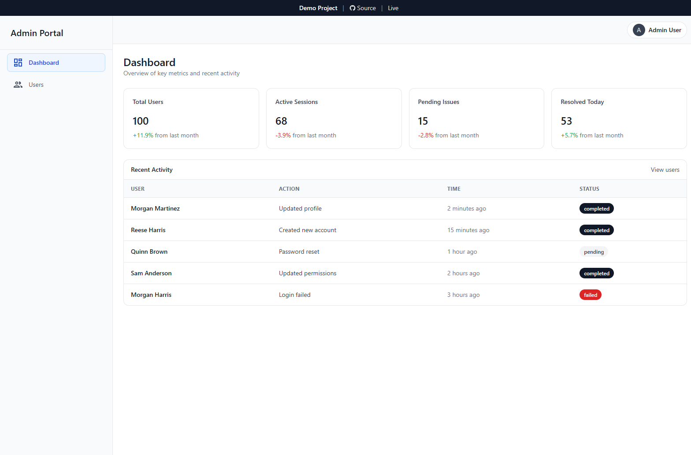
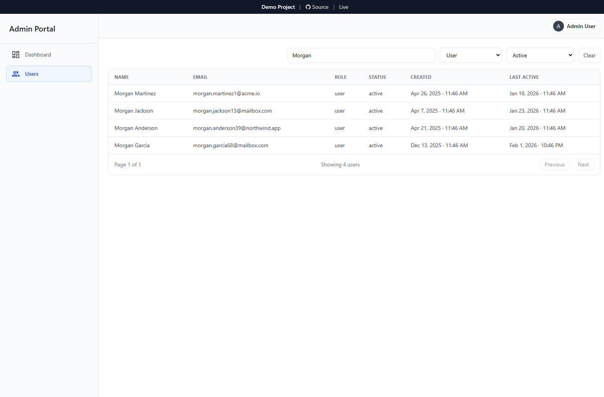

# Admin Dashboard

A data-heavy admin dashboard demo built with React + TypeScript. Focused on real-world table UX: sorting, pagination, filters, and robust loading/empty/error states.

**About:** This is a front-end focused demo. Data is mocked to showcase table UX patterns and route-driven detail navigation.

## Live Demo
- https://admin-dashboard-theta-beige-70.vercel.app

## Preview



## Features

### Users
- Sortable, paginated users table
- Global search (name/email)
- Status + role filters (composable)
- Clear filters action
- Loading, empty, and error states
- Row click navigation to user detail page
- Stable pagination behavior while filtering/searching

### Layout
- Sidebar + topbar layout
- Admin-friendly scroll behavior (page scroll + table horizontal scroll)

## Tech Stack
- React + TypeScript
- React Router
- TanStack Query
- TanStack Table
- Tailwind CSS
- Vite

## Getting Started
```bash
npm install
npm run dev
npm run build
npm run preview
